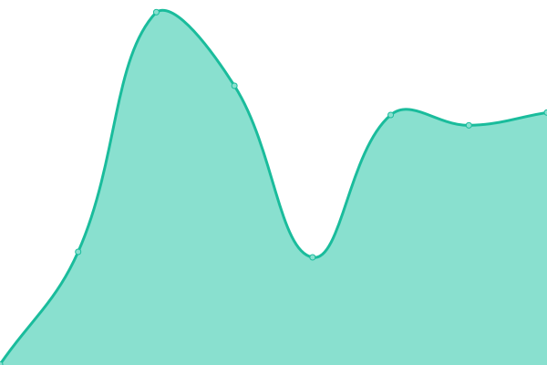

# [📈 Live Status](https://david-osl.github.io/xrp_cluster_monitoring): <!--live status--> **🟧 Partial outage**

This repository contains the open-source uptime monitor and status page for [david-osl](https://david-osl.github.io/xrp_cluster_monitoring), powered by [Upptime](https://github.com/upptime/upptime).

With [Upptime](https://upptime.js.org), you can get your own unlimited and free uptime monitor and status page, powered entirely by a GitHub repository. We use [Issues](https://github.com/david-osl/xrp_cluster_monitoring/issues) as incident reports, [Actions](https://github.com/david-osl/xrp_cluster_monitoring/actions) as uptime monitors, and [Pages](https://david-osl.github.io/xrp_cluster_monitoring) for the status page.

<!--start: status pages-->
<!-- This summary is generated by Upptime (https://github.com/upptime/upptime) -->
<!-- Do not edit this manually, your changes will be overwritten -->
<!-- prettier-ignore -->
| URL | Status | History | Response Time | Uptime |
| --- | ------ | ------- | ------------- | ------ |
|  [XRP S1](https://s1.ripple.com:51234) | 🟥 Down | [xrp-s1.yml](https://github.com/david-osl/xrp_cluster_monitoring/commits/HEAD/history/xrp-s1.yml) | 

 678ms
     
 | 

<a href="https://david-osl.github.io/xrp_cluster_monitoring/history/xrp-s1">98.46%</a>
    

|  [XRP S2](https://s2.ripple.com:51234) | 🟩 Up | [xrp-s2.yml](https://github.com/david-osl/xrp_cluster_monitoring/commits/HEAD/history/xrp-s2.yml) | 

 498ms
     
 | 

<a href="https://david-osl.github.io/xrp_cluster_monitoring/history/xrp-s2">97.82%</a>
    

|  [XRPL Cluster](https://xrplcluster.com) | 🟩 Up | [xrpl-cluster.yml](https://github.com/david-osl/xrp_cluster_monitoring/commits/HEAD/history/xrpl-cluster.yml) | 

 414ms
     
 | 

<a href="https://david-osl.github.io/xrp_cluster_monitoring/history/xrpl-cluster">100.00%</a>
    

<!--end: status pages-->

[**Visit our status website →**](https://david-osl.github.io/xrp_cluster_monitoring)

## 📄 License

- Powered by: [Upptime](https://github.com/upptime/upptime)
- Code: [MIT](./LICENSE) © [david-osl](https://david-osl.github.io/xrp_cluster_monitoring)
- Data in the `./history` directory: [Open Database License](https://opendatacommons.org/licenses/odbl/1-0/)
